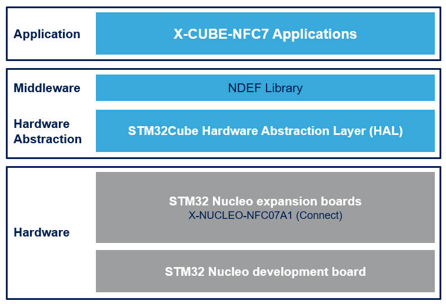

# X-CUBE-NFC7

The X-CUBE-NFC7 software package is an expansion for STM32Cube. This software provides drivers running on STM32 for ST25DVxxKC device. It is built on top of STM32Cube software technology that ease portability across different STM32 micro-controllers. This Expansion Firmware is built over the X-NUCLEO-NFC07A1 Expansion Board. This Expansion Board can be plugged on the Arduino UNO R3 connectors of any STM32 Nucleo board. The user can mount the ST Morpho connectors if required. The Expansion Board can be easily stacked in order to evaluate different devices with NFC communication.

**X-CUBE-NFC7 software features**:

- Complete middleware to build applications using our dynamic NFC tag (ST25DV64KC)

- Easy portability across different MCU families thanks to STM32Cube

- Free user-friendly license terms

- Examples implementation available on board X-NUCLEO-NFC07A1 plugged on top of one NUCLEO board

Here is the list of references to user documents:

- [X-NUCLEO-NFC07A1 SCHEMATIC](https://www.st.com/resource/en/schematic_pack/x-nucleo-nfc07a1_schematic.pdf)
- [Dynamic NFC/RFID tag IC with 64-Kbit EEPROM, and fast transfer mode capability](https://www.st.com/resource/en/datasheet/st25dv64kc.pdf)
- [UM2961 Getting started with the X-CUBE-NFC7 dynamic NFC/RFID tag IC software expansion for STM32Cube](https://www.st.com/resource/en/user_manual/um2961-getting-started-with-the-xcubenfc7-dynamic-nfcrfid-tag-ic-software-expansion-for-stm32cube-stmicroelectronics.pdf)
- [Getting started with the X-NUCLEO-NFC07A1 NFC/RFID tag IC expansion board based on ST25DV64KC for STM32 Nucleo](https://www.st.com/resource/en/user_manual/um2960-getting-started-with-the-xnucleonfc07a1-nfcrfid-tag-ic-expansion-board-based-on-st25dv64kc-for-stm32-nucleo-stmicroelectronics.pdf)